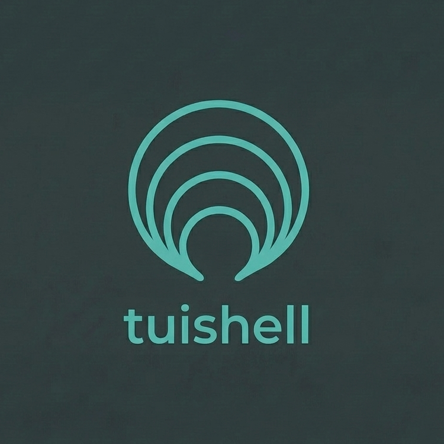

# tuishell



[](https://github.com/felipeospina21/tuishell)
[](https://github.com/felipeospina21/tuishell/blob/main/LICENSE)
[](https://github.com/felipeospina21/tuishell/releases)
[](https://github.com/felipeospina21/tuishell/actions/workflows/ci.yml)
[](https://goreportcard.com/report/github.com/felipeospina21/tuishell)

A reusable 3-panel TUI framework for [Bubble Tea](https://github.com/charmbracelet/bubbletea) applications.

tuishell handles the common infrastructure of panel-based terminal UIs: layout computation, panel routing, modal overlays, statusline, task management, and global keybindings — so you can focus on your domain logic.

## Features

- **3-panel layout** — left (navigation), main (content), right (details) with automatic sizing
- **Panel routing** — focus management and keyboard navigation between panels
- **Modal overlay** — centered modal with copy/submit actions
- **Popover components** — lightweight overlays: list picker, confirmation dialog, text input, multi-select filter with mixed checkbox/input fields
- **Statusline** — mode indicator, project label, spinner, help keybindings
- **Task management** — loading states with automatic spinner and error handling
- **Theming** — 30 semantic color tokens, fully customizable
- **Global keybindings** — help modal, quit, panel toggle, demo-mode keys

## Installation

```bash
go get github.com/felipeospina21/tuishell
```

## Quick Start

```go
package main

import (
    "fmt"
    "os"

    tea "charm.land/bubbletea/v2"
    "charm.land/lipgloss/v2"
    "github.com/felipeospina21/tuishell"
    "github.com/felipeospina21/tuishell/shell"
    "github.com/felipeospina21/tuishell/style"
)

func main() {
    p := tea.NewProgram(newApp())
    if _, err := p.Run(); err != nil {
        fmt.Println("Error:", err)
        os.Exit(1)
    }
}

type app struct {
    shell shell.Model
}

func newApp() tea.Model {
    theme := myTheme() // define your own style.Theme

    leftStyle := lipgloss.NewStyle().
        PaddingRight(2).
        Border(lipgloss.NormalBorder(), false, true, false, false).
        BorderForeground(theme.Border).
        Width(25)

    return app{shell: shell.New(shell.Config{
        Theme:          theme,
        LeftPanel:      &myLeftPanel{},
        MainPanel:      &myMainPanel{},
        AppIcon:        "📦",
        Keybinds:       tuishell.GlobalKeys(false),
        LeftPanelWidth: 25,
        LeftPanelStyle: leftStyle,
    })}
}

func (m app) Init() tea.Cmd { return m.shell.Init() }

func (m app) Update(msg tea.Msg) (tea.Model, tea.Cmd) {
    var cmd tea.Cmd
    m.shell, cmd = m.shell.Update(msg)
    return m, cmd
}

func (m app) View() tea.View { return m.shell.RenderView() }
```

## Documentation

- [Shell Configuration](docs/shell.md) — Config options and defaults
- [Messages](docs/messages.md) — Shell messages for panel-to-shell communication
- [Theming](docs/theming.md) — Color tokens and custom themes
- [Panels](docs/panels.md) — Creating panels and the SelectionProvider interface

## Example

Run the included example:

```bash
cd example && go run .
```

## Used By

- [mrglab](https://github.com/felipeospina21/mrglab) — GitLab merge requests TUI
- [jiraf](https://github.com/felipeospina21/jiraf) — Jira issues TUI

## License

MIT
